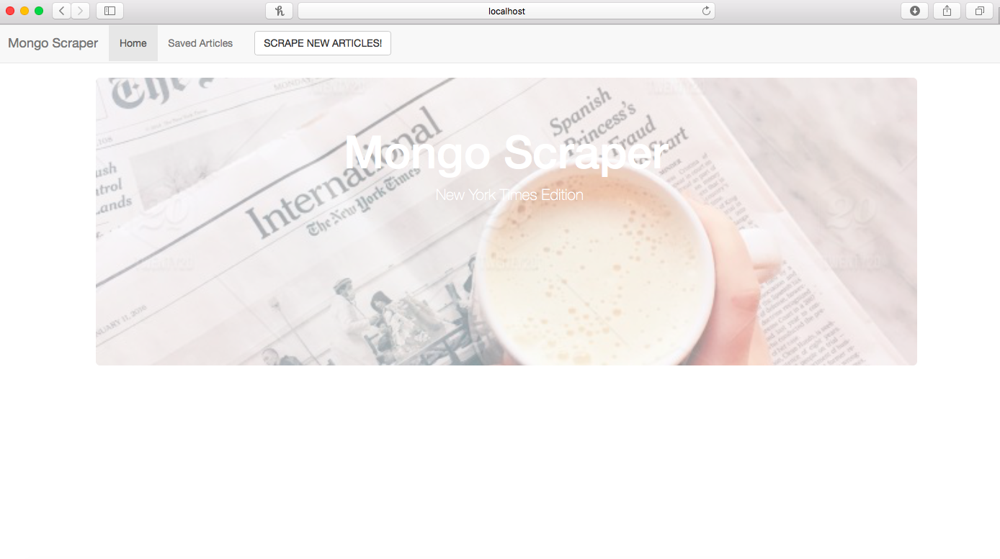
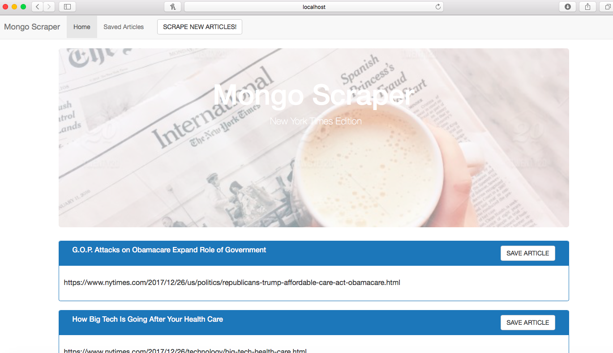
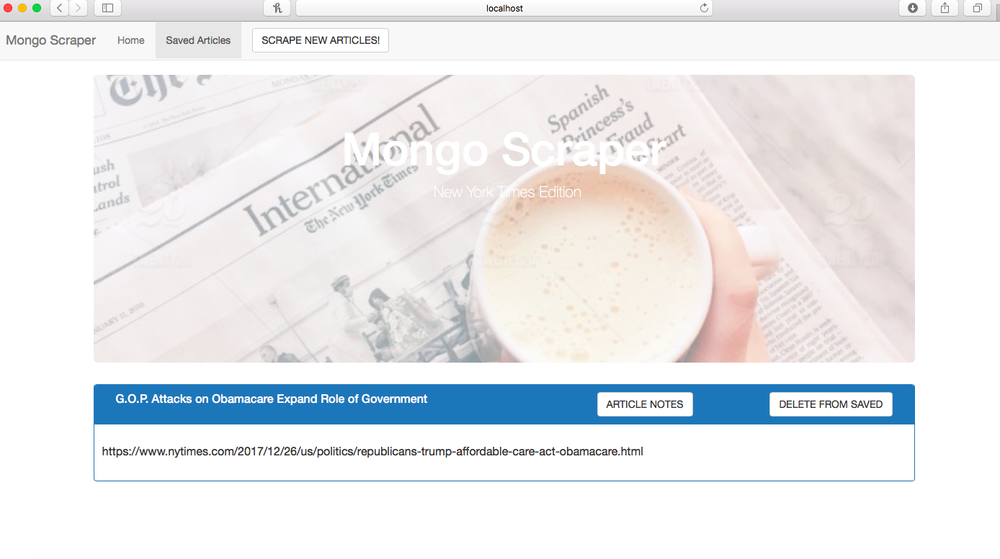
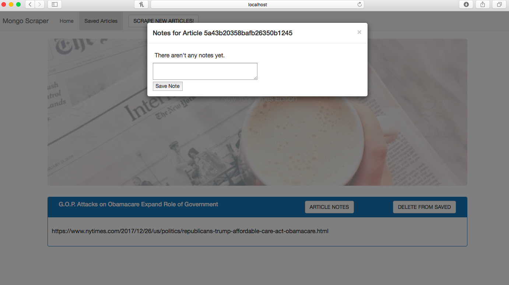

#MongoScraper:

A web app that lets users view and leave comments on the latest news. Using Mongoose and Cheerio to scrape news from another site.

##Description:

This application demonstrates a simple full stack application with a front end implemented with HTML/CSS/Javascript and elements from the Bootstrap framework and the backend implemented with Node.js, Express, router, cheerio, and mongoose. HTML templating is done with the help of Handlebars.

## Image Demo
#### Home Screen

#### Scraper Screen

#### Saved Articles Screen

#### Note Screen
